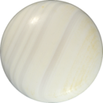

    

        

            

                
                
            

        

    

    
    

        <h1>Connor Hay</h1>
        
Full Stack Engineer & Data Scientist

        
University of Virginia • Vienna, VA

        

            <a href="mailto:cwhay888@gmail.com">cwhay888@gmail.com</a>
            <a href="https://linkedin.com/in/connor-w-hay/" target="_blank">LinkedIn</a>
            <a href="https://github.com/VexedPanda888" target="_blank">GitHub</a>
        

    

    
    

        ↓
    

    

        

            <h2>About</h2>
            
TBW

        

